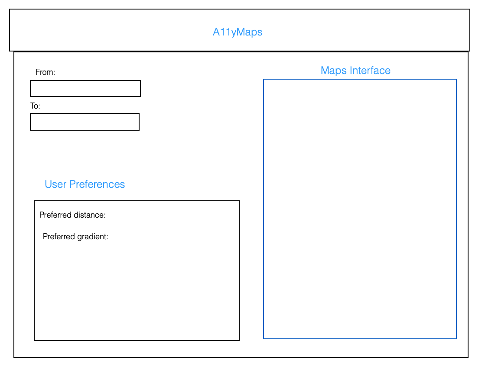

# A11yMaps

A11yMaps (Accessibility Maps) is an accessibility focused web application that provides walking navigation services for users with diverse mobility needs. Using the Google Maps and Elevation APIs, we developed a proof of concept tool to assess and rank the difficulty of potential routes for a journey based on a user’s specified elevation profile preferences. Through this app, we sought to provide a more inclusive navigation experience that allows users to tailor their journeys by finding the most suitable route to get to their destination.

## Project Description & Goals

--------------------------------------------------------------------------------------------------

The main goals of this project were to design a tool to allow individuals who may not be able to travel routes with steeper inclines to plan their journeys, as well as utilize the tool to conveniently store these ranked routes for easy referencing.

With this main goal in mind, our task requirements were the following:

### Minimal requirements

- :white_check_mark: **User Account Setup** - allow users to create accounts to persist their data, and allow login and logout functionality.

- :white_check_mark: **Create Elevation Preference Profile** - allow users to specify elevation criteria preferences that can be tied to their profile, and used in route ranking calculations.

- :white_check_mark: **Query For Routes** - provide users with an intuitive UI to get route results for a journey by inputting an origin and destination location

- :white_check_mark: **Retrieve Route & Elevation Data from Google Maps API** - retrieve route data from the Google Maps Directions API using the locations provided by the user, and tie this with Elevation Data from the Google Elevation API.

- :white_check_mark: **Rank Routes by “Difficulty”** - rank and re-order routes by how difficult they are in terms of how steep the elevation/incline is.

### Standard Requirements

- :white_check_mark: **Incorporate User Preferences into Route Calculations** -  use the user profile settings for weight, max incline, and preference for distance or incline to calculate a total score for each route. This required figuring out how to adapt calculations from https://doi.org/10.1179/000870406X93517.

- :white_check_mark: **Display Elevation/Distance Profile of Each Route** - provide a detailed display of information about each route, including elevation, distance, rating, etc. to allow users to gauge which routes they may prefer.

- :white_check_mark: **Saved Locations/Routes** - allow users to label and save routes so that they can easily pull up past searched routes for reference.

- :white_check_mark: **Email Verification For Recovering Password** - allow users to recover a forgotten password via email verification. This required figuring out how to use `nodemailer`.

### Stretch Requirements

- :white_check_mark: **Add Per-Request Authentication via Cookies** - add authentication using cookies for every request to secure our application. This required figuring out how to use the `js-cookie` 3rd party library to safely transmit session ids.

- :white_check_mark: **Allow Users to Visually Compare Routes** - allow users to switch the map display depending on which route they want to view. This required a lot of coordination on the React-Redux state, in addition to properly liasing with the payloads from the backend.

- :x: **Store Saved Routes Locally (To Improve Latency) and Update Route As Necessary** - This would require figuring out a representation for the routes to be saved in the database, and implementing watchers for changes.
  
- :x: **Implementing a Custom Routing Algorithm** - implement a custom routing algorithm. Doing this would allow us to sample elevation from points and come up with our own routes independent of Google's results.

- :x: **Allow Users to Self-Report Obstructions Along Route and Accomodate Paths or Recommendations Accordingly** - this requires the previous stretch goals to be accomplished.

- :x: **Turn by Turn Navigation** - this would provide users with detailed instructions for turn by turn navigation.

- :x: **Ability to Simulate the Route** - this would allow users to view the route, like in Google Maps Street Views.

- :x: **Add “Use My Location" as an Origin/Destination and for Map Initialization** - this would be a quality of life improvement.

## Tech

--------------------------------------------------------------------------------------------------

- **Unit 1 - HTML, CSS, JS** - These 3 technologies were heavily utilized indirectly throughout the project, through the realization of all the other technologies. For the UI, manipulation and interfacing with HTML was used through the virtual DOM of React to quickly create components, while CSS was utilized to add custom styling to components. And Javascript was the primary development language utilized to write both frontend (React+Redux) and backend (Node+MongoDB) code.
- **Unit 2 - React/Redux** - The user interface was designed with the React Framework and the MaterialUI component library to quickly build the structure of our application using standardized components. Redux was also incorporated to allow us to easily manage state across the various components we created as our frontend grew in complexity.
- **Unit 3 - Node/Express** - The Node.js framework was used to write the backend code, allowing us write queries to the Google Maps API services, code the processing of the route result data, and manage cookies. Express was used as our web server, to setup APIs that allowed our backend code to interface and serve responses to frontend requests.
- **MongoDB** - MongoDB was used as our primary persistent data storage. User Preferences, access tokens, validation status, and saved routes were stored in a MongoDB server, with the information being associated with the user's email address. The utilization of MongoDB allowed us to rapidly prototype and work with databases with its flexible schema, compared to a SQL database.
- **Heroku** - Heroku was utilized to deploy our full-stack application. The frontend react web app and the Express+MongoDB backend server were deployed as two separate dynos respectively, with ents setup to track any GitHub changes.

## Above and Beyond Functionality

------------------------------------------------------------------------------------------------

**High Interactivity And Data Processing**
Through the integration of the Google Maps APIs, we incorporated a fully functional location service, as well as made use of various external APIs to extract route directions and elevation data. After obtaining this data, utilizing an algorithm adapted from the academic literature that incorporates the user preferences, the routes were rated and scored for difficulty.

**Improved Security**
By integrating `nodemailer` for email verification and password recovery, and `js-cookies` for session id cookie management.

We integrated the nodeMailer library into the Express server and setup a custom email which is used to send email messages. The custom email's security credentials are stored as Environmental Variables in the server, which are not accessible to users. In addition, we setup Js-cookies to be used for login credentials and login verification. When a user logs in or signs up, a unique uuid is generated for the user on the server end and sent over as a cookie to the client. The Google maps API credentials required for rendering google maps is also sent over as a cookie, ensuring that the maps API can't be accessed without logging in. A custom domain name was used for our client, and server as herokuapp itself prevents cookie transfer due to it being listed on the public suffix list.  The domain target for the cookie was specified, and the CORS policy was set up to allow for the cookie transfering between server and client. When a user logs out, the server wipes the cookie values on the client and server side, removing the persistent login and the map id until the user logs in again.

## Next Steps

------------------------------------------------------------------------------------------------

Potential future directions for development could involve continuing to improve the usability and accuracy of our application through 3 main areas of work:

- Make the application more accessible through the full integration of ARIA standards such as tagging all components with aria-tags, or the utilization of the React-Aria library.
- Incorporate road surface and curb/step information (through interfacing with other external APIs) and self-reported (or crowd-sourced) user data on route obstacles, to more accurately model the score for a given route, as well as steer users clear of those obstacles.
- Due to the nature of the application and the likelihood of being used on the go, we would ideally seek to make improvements to support a more mobile-friendly experience (possibly through React Native).

## Task Breakdown

### Justin

- Setup main infrastructure for the frontend, including React, React Router, an MaterialUI, custom styling, and base layouts for the various components we used.
- Did research into how to use the backend Google Maps Client, and implemented the actual API query calls from the frontend to the backend, and to the Google Maps APIs on the backend.
- Properly hooked up the backend payloads to the frontend, and implemented the functionality for utilizing the payload to interactively display the route results after querying, and loading saved routes.

### Fraser

- Performed literature search for papers relating to wheelchair navigation and routing algorithms. Adapted that information into the rating algorithm used in the application and implemented it.
- Performed the initial setup of the frontend portions of the app that made use of the Google Maps API, such as the map and autocomplete.
- Utilized Google Maps APIs to query the routes as well as break them down and query points along the route in order to feed that information into the rating algorithm.

### Hawk

- Created the cookie login and email verification system for persistent user login and the error messaging.
- Set up the git action and heroku repositories for integrating and deploying pulls and merges to the main branch for both server and client.
- Created the server routes for user and route preferences and the mongoDb models for user and route preferences.

## Prototype Sketches

### Wireframe Sketches

#### Login Page

#### Input Page

#### Output Page

#### Request-Response Flow with Google Maps API

